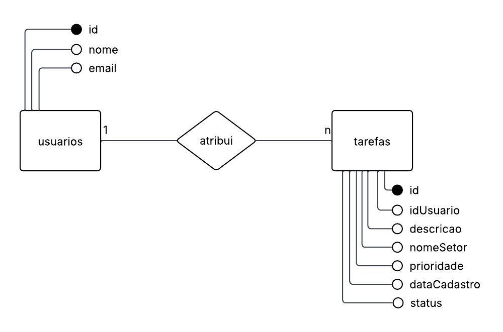
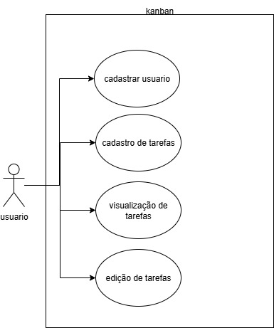

# Kanban - Controle de Tarefas

## Documentação / Diagramas

## Explicação
### index.php
Responsável por mostrar a principal parte do sistema, onde é possível ver todas as tarefas em colunas de acordo com seus status. As tarefas possuem ordem de prioridade (alta para baixa) e podem ser movidas entre os campos através de botões que se conectam com o arquivo moverTarefa.php. Além disso, é possível editar uma tarefa específica ou deletar. Nesse último caso, é feita uma comunicação com o arquivo excluirTarefa.php.
### moverTarefa.php 
Executa a ação de modificar o status de uma tarefa sem a interção direta com o usuário nesse arquivo.
### excluirTarefa.php 
Executa a ação de excluir uma tarefa sem a interção direta com o usuário nesse arquivo.
### cadastrarTarefa.php 
Exibe um formulário que permite que o usuário adicione ou modifique uma tarefa.
### cadastarUsuario.php 
Exibe um fórmulário que adiciona usuários.
